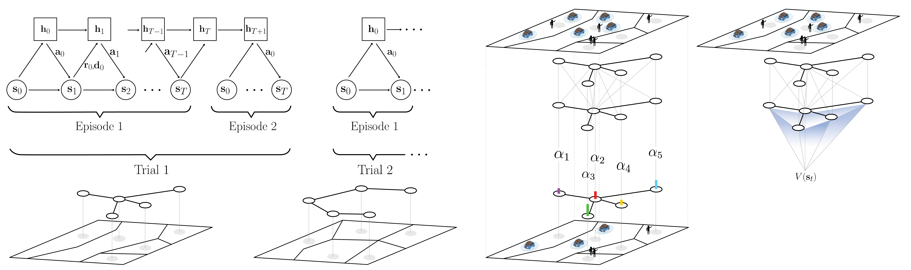

# Graph Meta-RL for AMoD
Official implementation of [Graph Meta-Reinforcement Learning for TransferableAutonomous Mobility-on-Demand](https://arxiv.org/abs/2202.07147)

</td> <br/>

## Prerequisites

You will need to have a working IBM CPLEX installation. If you are a student or academic, IBM is releasing CPLEX Optimization Studio for free. You can find more info [here](https://community.ibm.com/community/user/datascience/blogs/xavier-nodet1/2020/07/09/cplex-free-for-students)

To install all required dependencies, run
```
pip install -r requirements.txt
```

## Contents

* `src/algos/gnn.py`: PyTorch implementation of Temporal Graph Networks for A2C.
* `src/algos/reb_flow_solver.py`: thin wrapper around CPLEX formulation of the Minimum Rebalancing Cost problem (Section 3 in the paper).
* `src/envs/amod_env.py`: AMoD simulator.
* `src/cplex_mod/`: CPLEX formulation of Rebalancing and Matching problems.
* `src/misc/`: helper functions.
* `data/`: json files for both meta-train and meta-test cities.
* `saved_files/`: directory for saving results, logging, etc.

## Examples

To train an agent, `main.py` accepts the following arguments:
```bash
cplex arguments:
    --cplexpath     defines directory of the CPLEX installation
    
model arguments:
    --test          activates agent evaluation mode (default: False)
    --max_trials    number of trails to train agent (default: 3k)
    --max_episodes  number of episodes within each trial (default: 10)
    --max_steps     number of steps per episode (default: T=20)
    --max_test_iter number of repeated experiments at test time
    --hidden_size   number of hidden states in neural nets
    --clip          vector magnitude used for gradient clipping
    --no-cuda       disables CUDA training (default: True, i.e. run on CPU)
    --directory     defines directory where to log files (default: saved_files)
    
simulator arguments: (unless necessary, we recommend using the provided ones)
    --seed          random seed (default: 10)
    --json_tsetp    (default: 3)
```

**Important**: Take care of specifying the correct path for your local CPLEX installation. Typical default paths based on different operating systems could be the following
```bash
Windows: "C:/Program Files/ibm/ILOG/CPLEX_Studio128/opl/bin/x64_win64/"
OSX: "/Applications/CPLEX_Studio128/opl/bin/x86-64_osx/"
Linux: "/opt/ibm/ILOG/CPLEX_Studio128/opl/bin/x86-64_linux/"
```
### Training and simulating an agent

1. To train an agent run the following:
```
python main.py
```

2. To evaluate a pretrained agent run the following:
```
python main.py --test=True
```

## Credits
This work was conducted as a joint effort with [Kaidi Yang*](https://sites.google.com/site/kdyang1990/), [James Harrison°](https://stanford.edu/~jh2/), [Filipe Rodrigues'](http://fprodrigues.com/), [Francisco C. Pereira'](http://camara.scripts.mit.edu/home/) and [Marco Pavone*](https://web.stanford.edu/~pavone/), at Technical University of Denmark', Stanford University* and Google Research, Brain Team°. 

## Reference
```
@inproceedings{GammelliYangEtAl2021,
  author = {Gammelli, D. and Yang, K. and Harrison, J. and Rodrigues, F. and Pereira, F. C. and Pavone, M.},
  title = {Graph Meta-Reinforcement Learning for TransferableAutonomous Mobility-on-Demand},
  year = {2022},
  note = {Submitted},
}
```

----------
In case of any questions, bugs, suggestions or improvements, please feel free to contact me at daga@dtu.dk.